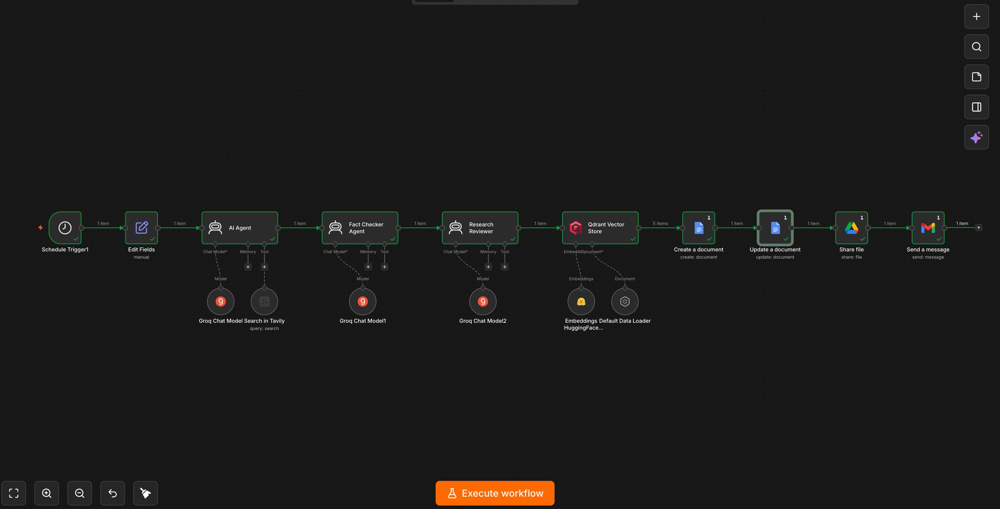
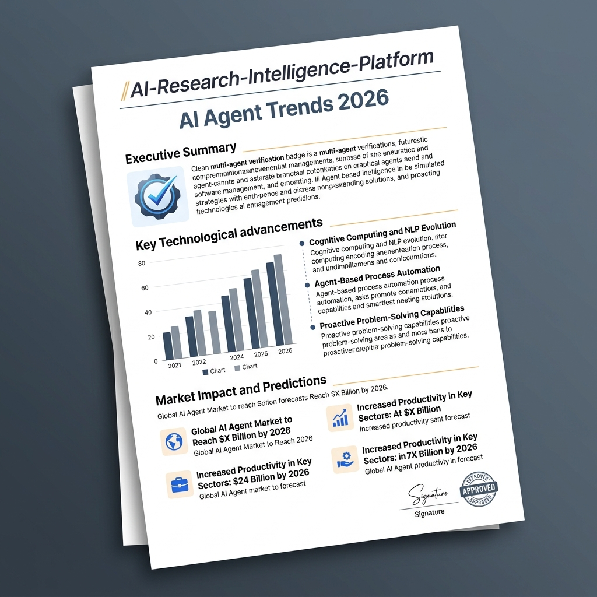
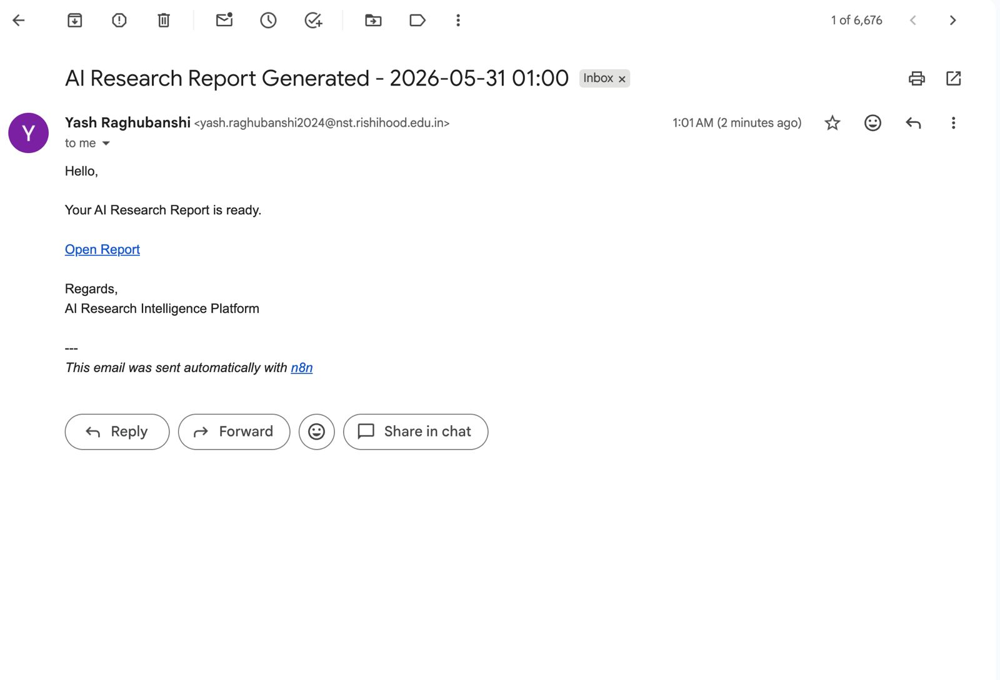

# 🚀 Autonomous AI Research Intelligence Platform

## Overview

The Autonomous AI Research Intelligence Platform is an end-to-end AI-powered research automation system built using n8n. The platform performs live web research, validates information through multiple AI agents, stores knowledge in a vector database, generates structured reports, and automatically delivers research results via email.

The system eliminates manual research efforts by continuously gathering, analyzing, verifying, and organizing information from the web.

---

## Problem Statement

Researchers, students, founders, and professionals spend significant time:

* Searching for information manually
* Verifying facts from multiple sources
* Organizing research findings
* Creating reports
* Sharing results with stakeholders

This platform automates the complete research workflow.

---

## Features

### Live Web Research

* Fetches real-time information from the internet using Tavily Search API.
* Retrieves the latest articles, reports, blogs, and industry insights.

### Multi-Agent Research Workflow

* Research Agent gathers information.
* Fact Checker Agent validates claims and removes inaccuracies.
* Research Reviewer Agent creates a structured final report.

### Vector Database Integration

* Stores research documents in Qdrant Vector Database.
* Enables semantic search and retrieval.

### RAG (Retrieval-Augmented Generation)

* Retrieves relevant knowledge from previously stored documents.
* Improves answer quality and contextual understanding.

### Automated Report Generation

* Generates professional research reports.
* Saves reports directly into Google Docs.

### Automatic Sharing

* Creates shareable Google Docs links.
* Automatically grants viewing permissions.

### Email Notifications

* Sends generated reports directly to users through Gmail.

### Scheduled Execution

* Supports fully automated daily or weekly research workflows.

---

### n8n Workflow Process Image

### Data Flow Process

Topic Input $\rightarrow$ Research Agent $\rightarrow$ Fact Checker Agent $\rightarrow$ Research Reviewer Agent $\rightarrow$ Qdrant Vector Database $\rightarrow$ RAG Search Agent $\rightarrow$ Google Docs Report Generator $\rightarrow$ Google Drive Share File $\rightarrow$ Gmail Notification

---

## Tech Stack

### Automation

* n8n

### AI Models

* Groq LLM
* Llama 3.1 / Llama 3.3

### Search

* Tavily Search API

### Vector Database

* Qdrant

### Embeddings

* Google Gemini Embeddings / Hugging Face Embeddings

### Document Generation

* Google Docs API

### File Sharing

* Google Drive API

### Notifications

* Gmail API

---

## Project Architecture

### Research Agent

Responsibilities:

* Perform topic-based research
* Gather latest information from web sources
* Create structured findings

### Fact Checker Agent

Responsibilities:

* Validate research findings
* Remove unsupported claims
* Improve reliability

### Research Reviewer Agent

Responsibilities:

* Create final research report
* Organize insights
* Generate executive summary

### Qdrant Vector Store

Responsibilities:

* Store embeddings
* Enable semantic retrieval
* Maintain knowledge base

### RAG Search Agent

Responsibilities:

* Retrieve relevant stored information
* Improve report quality
* Provide contextual memory

---

## Example Use Cases

### AI Industry Research

Input:

Latest AI Agent Trends 2026

Output:

* Industry analysis
* Emerging trends
* Business opportunities
* Risk assessment
* Future predictions

---

### Startup Research

Input:

Top Startup Funding Trends in India

Output:

* Funding analysis
* Investor insights
* Startup ecosystem trends

---

### Market Intelligence

Input:

Electric Vehicle Market in India

Output:

* Market growth
* Competitor analysis
* Future opportunities

---

## Installation

### Clone Repository

git clone https://github.com/Yash990-bit/AI-Research-Intelligence-Platform.git

cd AI-Research-Intelligence-Platform

---

## Setup

### 1. Import Workflow

Import the provided workflow.json file into n8n.

### 2. Configure Credentials

Add:

* Tavily API Key
* Groq API Key
* Google Docs OAuth
* Google Drive OAuth
* Gmail OAuth
* Qdrant API Key

### 3. Configure Qdrant

Create Collection:

Name:
ai_research_reports

Distance:
Cosine

---

## Results

The platform automatically:

✔ Researches live topics

✔ Validates information

✔ Stores knowledge in vector database

✔ Generates structured reports

✔ Creates shareable Google Docs

✔ Sends email notifications

✔ Supports scheduled automation

### Visual Outputs

#### 1. Generated Research Report

#### 2. Email Notification Delivery

---

## Future Improvements

* Slack Notifications
* Microsoft Teams Integration
* PDF Report Generation
* LinkedIn Post Generation
* Blog Generation
* Dashboard Analytics
* Multi-Language Research
* Knowledge Graph Integration

